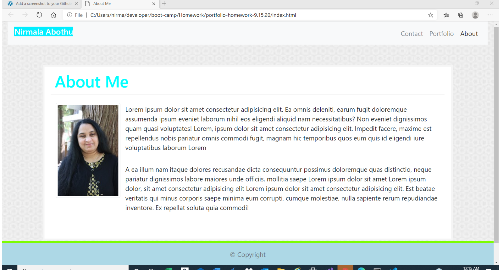
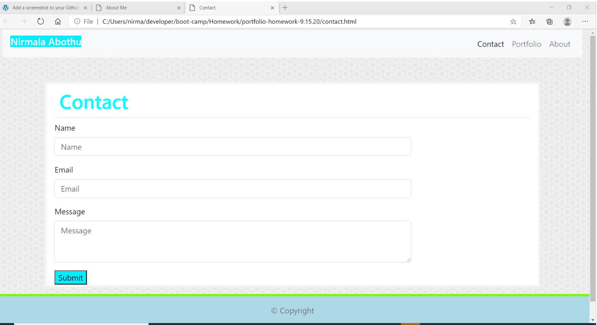
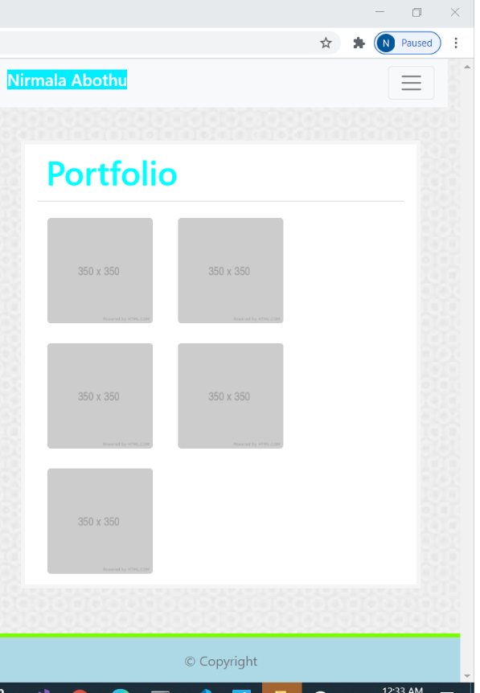

# HOMEWORK-ASSIGNMENT2: portfolio

---

## About The Project

---

This is starting of creating Portfolio.
This contains information about my professional background and projects
on which i will be contribute individual or with team and contact information.
Created

## index.html

-    Built HTML page with Bootstrap grid system
-    For Navbar and list items
-    For content and footer
-    Added appropriate semantic HTML elements for accessible.

## contact.html

-    Used Bootstrap form
-    For contact form

## portfolio.html

## CSS

-    Used external CSS to decortate the HTML elements

-    Used CSS selectors for tags,classes

## Built With

-    HTML and CSS

## Getting Started

To get a local copy up and running follow below steps.

## Prerequisites

None

## Installation

Clone the repo
git clone git@github.com:NirmalaAbothu/portfolio-homework-9.15.20.git

## Credits

Followed the documentation of https://getbootstrap.com/
to understand the Bootstrap grid system to apply in my project

---

## License & copyright

Copyright © 2020 Nirmala Abothu

## Deployed project link

[Portfolio](https://nirmalaabothu.github.io/portfolio-homework-9.15.20/)
